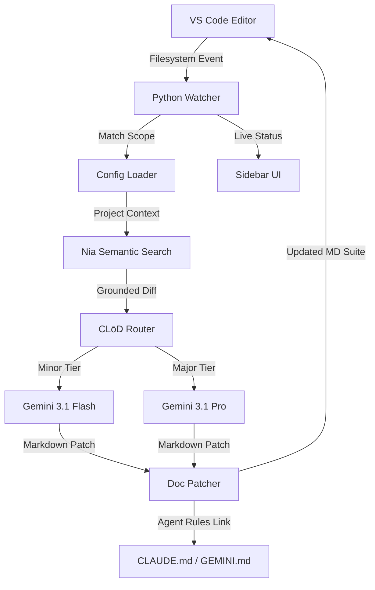

# ARCHITECTURE.md — DocJanitor

This document outlines the high-level architecture of the **Auto-Doc Janitor** system.

## 🏗️ System Overview

DocJanitor operates as a **Hybrid Agentic System**, splitting responsibilities between a performance-oriented VS Code frontend and a heavy-lifting Python backend.

## 🧩 Core Components

### 1. The Watcher & Config Loader
A robust filesystem observer that debounces save events. It reads `.janitor.config.json` to orchestrate updates across multiple documentation targets (API, Structure, Onboarding) simultaneously.

### 2. Nia Context Infrastructure
Before any AI call, the agent queries Nia to retrieve external context like Slack threads, specifications, or existing documentation. This "grounds" the AI, ensuring it understands *why* a change was made, not just *what* code changed.

### 3. The Summarizer (CLōD AI)
The "brain" of the operation. It performs surgical updates across the document suite rather than full regenerations, maintaining consistency across multiple `.md` files in a single pass.

### 4. Agentic Interoperability Layer
A unique feature that "grounds" other AI agents. By injecting directives into `CLAUDE.md` and `.cursorrules`, DocJanitor ensures that the entire AI ecosystem in the workspace shares a single source of truth.

---
*Last Updated: 2026-05-10*
