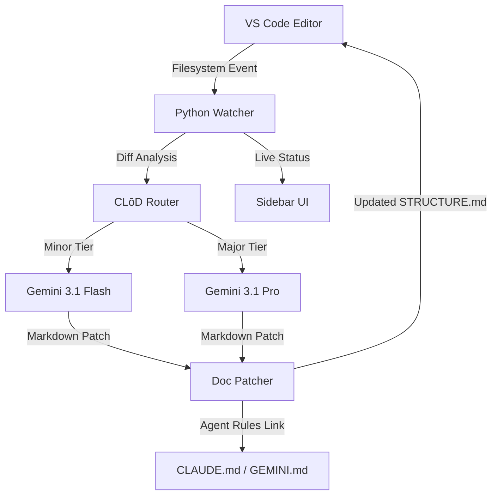

# ARCHITECTURE.md — DocJanitor

This document outlines the high-level architecture of the **Auto-Doc Janitor** system.

## 🏗️ System Overview

DocJanitor operates as a **Hybrid Agentic System**, splitting responsibilities between a performance-oriented VS Code frontend and a heavy-lifting Python backend.

## 🧩 Core Components

### 1. The Watcher (Python/Watchdog)
A robust filesystem observer that debounces save events to avoid documentation thrashing. It performs initial AST parsing to classify changes before routing to the AI.

### 2. The Bridge (TS/ChildProcess)
A line-buffered IPC bridge that manages the lifecycle of the Python agent. It parses newline-delimited JSON (NDJSON) to update the VS Code UI without blocking the editor thread.

### 3. The Summarizer (CLōD AI)
The "brain" of the operation. It maintains a context window of the current `STRUCTURE.md` and performs surgical updates rather than full regenerations, significantly reducing token usage and latency.

### 4. Agentic Interoperability Layer
A unique feature that "grounds" other AI agents. By injecting directives into `CLAUDE.md` and `.cursorrules`, DocJanitor ensures that the entire AI ecosystem in the workspace shares a single source of truth.

---
*Last Updated: 2026-05-10*
